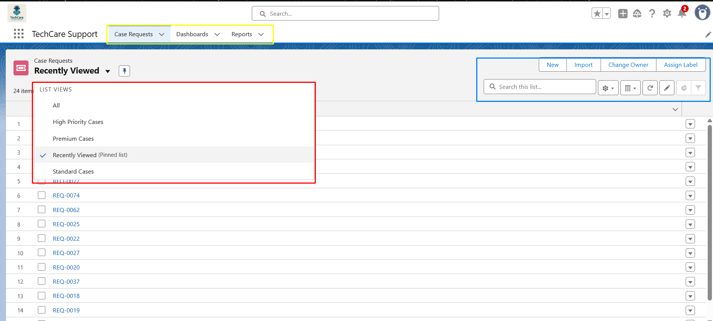

# Desafio TechCare
## Nome do aluno: Paulo Roberto Gonçalves da Silva Junior
## Perfil escolhido: Dev / Admin

## Caso de Uso:
A TechCare é uma empresa de suporte a clientes que lançou um Portal de Atendimento
em Salesforce. A empresa solicita os seguintes requisitos no referido portal de atendimento:
* A criação de um objeto customizado para recepcionar e registrar os pedidos de suporte;

* Processos de negócio claros (triagem, escalonamento e resolução);

* Relatórios e dashboards gerenciais para acompanhamento de métricas;

* Funcionalidades automáticas e customizadas via código.

## Intruções de Instalação:
>Necessária a instalação do Git e do Salesforce CLI para executar os comandos

Abra o prompt de comando e digite o seguinte código para clonar o repositório git
```bash
git clone https://github.com/DreeParker/projeto-TechCare.git
```
Navegue até o novo diretório
```bash
cd TechCare
```

Autorize sua org com o Salesforce CLI, salve com um alias "projectTechCare" e defina o usuário atual como usuário padrão
```bash
sf org login web -s -a projectTechCare
```

Implante o código do aplicativo na org
```bash
sf project deploy start -d force-app/main/default
```


# Apresentação e configurações iniciais

## - Apresentação do App TechCare Support:

  - Ao iniciar a org, por padrão é apresentado a tela inicial do app TechCare Support. Podemos ver na imagem que de inicio já vem selecionado a aba Case Requests, que mostra uma listagem de casos da qual o usuário tem acesso, a listagem atual pode ser alterada no canto superior esquerdo (Retangulo vermelho) para All (todos os casos), Premium Cases (Casos Premium), High Priority Cases (Casos de alta prioridade), e Standard Cases (Casos Standard).

> A visualização dessas listas de opções está sujeita ao perfil do usuário e as filas que o mesmo participa.

 - O retângulo amarelo mostra as abas disponíveis no app, sendo Case Requests, Dashboards, e Reports.

 - O retângulo azul refere-se aos botões com algumas ações disponíveis para serem realizadas nos casos, New (abrir um caso novo), Import (importar dados), Change Owner (mudar o dono do caso). Um pouco abaixo do botão há também algumas ferramentas de edição da lista de visualização atual, barra de pesquisa, botão de atualização, entre outros.




## - Perfis:

* Foram criados dois perfis para acessarem as funcionalidades do app TechCare Support, o perfil "Support Premium", destinado a operadores de suporte de casos alto nível, tendo como prioridade casos do tipo Premium, mas que também podem atender eventualmente a outros tipos de casos de acordo com a demanda. Esses usuários tem acesso a todas as informações relativas aos casos de qualquer categoria e podem criar, alterar, fechar, reabrir e excluir ambos os tipos de casos.

* O outro perfil é o "Support Standard", que se destina a operadores de suporte de casos nível médio e baixo, este perfil não tem acesso total a todas as informações relativas ao caso, e não podem reabrir casos fechados.


## - Grupos públicos:

* Foram criados 3 grupos públicos para atender ao fluxo de casos, Premium Group, destinado aos usuários com o perfil Support Premium, Standard Group, destinado aos usuários com perfil Support Standard, e High Priority Group, destinado a usuários com habilidades para resolver casos de alta complexidade 

## - Filas:

* Seguindo a mesma logica dos grupos públicos, foram criadas 3 filas para o redirecionamento dos casos e ágil atendimento dos mesmos, High Priority Cases, para casos escalados, Premium Cases, para casos do tipo Premium, Standard Cases para casos do tipo Standard.


# Composição do App TechCare

## __- Objetos:__

__1 - Case_Request__c__
  - Descrição;
  - Campos;
  - Validation Rules;
  - Layouts;
  - Flows;
  - Reports;
  - Dashboards;
  - Componentes LWC. 


__2 - Case_History__c__
  - Descrição;
  - Campos;
  - Classes Apex;


# Case_Request__c

## 1.1 - Descrição:

  - Este objeto tem como objetivo registrar casos abertos a partir de algum problema reportado por usuários da TechCare, e fornecer ao suporte uma interface amigável que concede agilidade no acesso a informação de tal problema, e na resolução do mesmo.

## 1.2 - Campos:

__- Name (Auto Number);__

  Armazena e atribui um numero gerado automaticamente ao registro assim que o mesmo é criado. Este campo deve ser visível e não editável ao usuário.

__- Close_Date__c (Date/Time):__

  Armazena a data e o horário que o registro Case Request é fechado. Este campo deve ser visível e não editável ao usuário.

__- Closed_by_Process__c (Checkbox):__

  Campo auxiliar para uma regra de validação, o mesmo é marcado como verdadeiro quando o registro é fechado via botão flow. Este campo não deve ser visível e editável ao usuário.

__- Contact__c (Lookup Contact):__

  Possibilita vincular um caso a um contato. Este campo deve ser visível e editável ao usuário.

__- CreatedById (Lookup User):__

  Campo criado automaticamente junto a criação do objeto, o mesmo guarda a informação do usuário que abriu o registro. Este campo deve ser visível e não editável ao usuário.

__- Description__c (Long Text Area):__

  Armazena todos os detalhes do problema que levou a abertura do Case. Os dados desse campo são inseridos pelo usuário. Este campo deve ser visível e editável ao usuário.

__- Escalated_Case__c (Checkbox):__

  Campo auxiliar para uma regra de validação, o mesmo é marcado como verdadeiro quando o registro é escalado via botão flow. Este campo não deve ser visível e editável ao usuário.

__- Has_Workaround__c (Checkbox):__

  Este campo fica visível quando o caso é escalado e deve ser marcado como verdadeiro quando houver uma solução de contorno para o referido caso. Este campo deve ser visível e editável ao usuário.

__- LastModifiedById (Lookup User):__

  Campo criado automaticamente junto a criação do objeto, o mesmo guarda a informação do ultimo usuário que alterou o registro. Este campo deve ser visível e não editável ao usuário.

__- Open_Days__c (Formula Number):__

  Este campo deve ficar visível enquanto o caso estiver aberto, o mesmo é preenchido automaticamente através de uma formula que calcula a diferença entre o dia de abertura do caso e a data atual. Este campo deve ser visível e não editável ao usuário.

__- OwnerId (Lookup User, Group):__

  Campo criado automaticamente junto a criação do objeto, o mesmo guarda a informação de para qual usuário ou grupo o registro está designado. Este campo deve ser visível e editável ao usuário.

__- Priority__c (Picklist):__

  Este campo é uma lista de seleção de valores para demonstrar o nivel de prioridade atual do registro, os valores disponíveis para serem selecionados são Low (baixo), Medium (médio), e High (alto). 

  No caso do tipo do registro ser Standard, por padrão a prioridade será baixa, e no caso do tipo ser Premium, a prioridade será alta. Este campo deve ser visível e editável ao usuário.

__- RecordTypeId (Record Type):__

  Campo criado automaticamente junto a criação do record type, o mesmo guarda a informação do tipo de registro definido de acordo com o perfil do usuário que o abriu (Premium ou Standard para usuários Support Premium, e Standard para usuários Standard). Este campo não deve ser visível e editável ao usuário.

__- Reopen_by_Process__c (Checkbox):__

  Campo auxiliar para uma regra de validação, o mesmo é marcado como verdadeiro quando o registro é reaberto via botão LWC. Este campo não deve ser visível e editável ao usuário.

__- Reopened_Case__c (Checkbox):__

  Esta caixa de seleção é preenchida com o valor verdadeiro quando o caso é reaberto, e a mesma só deve ser visível quando estiver preenchida com esse valor. O intuito desse campo é sinalizar que se trata de um caso que foi reaberto. Este campo deve ser visível e não editável ao usuário.

__- Resolution_Notes__c (Text Area 255):__

  Se trata de uma caixa de texto para que o usuário preencha com todas as informações relativas a resolução do caso. Este campo deve só deve ser visível e disponível para preenchimento a partir do momento em que o caso é fechado. Este campo deve ser visível e editável ao usuário.

__- SLA_Deadline__c (Date/Time):__

  Este campo demonstra e determina a data de vencimento para a resolução e fechamento do caso, a data de vencimento é definida automaticamente via flow, e deve ser de 24 horas a partir da data de abertura para casos do tipo Standard, e 8 horas para casos do tipo Premium. Este campo deve ser visível e não editável somente à usuários com o perfil Support Premium.

__- Status__c (Picklist):__

  Este campo é uma seleção de valores onde demonstra o status atual do registro, os valores disponíveis para seleção são New (Novo), In Progress (Em andamento), Escalated (Escalado), e Closed (Fechado). Este campo deve ser visível e editável ao usuário, porém deve ser possível selecionar somente os valores New e In Progress de acordo com as regras de validações vigentes para o campo, os outros valores são acessíveis somente via botão.

__- Subject__c (Text 255):__

  Caixa de texto a ser inserido pelo usuário com um titulo ou breve descrição do problema que se refere ao ponto principal do problema que levou a abertura do registro. Este campo deve ser visível e editável ao usuário.

__- Type__c (Picklist):__

  Este campo é uma lista de seleção de valores que visa mostrar ao visualizador o tipo do registro, os valores disponíveis para seleção são Standard e Premium, porém por padrão a lista já vem com o valor padrão populado com o tipo de campo correspondente ao RecordTypeId. Este campo deve ser visível e editável ao usuário.

  >Observação: É possível selecionar o valor "None" (Vazio) ao manipular essa lista de seleção, porém caso esse valor seja selecionado, uma regra de validação dispara obrigando a manter o tipo correto do registro.

__- Workaround__c (Long Text Area):__

  Se trata de uma caixa de texto que fica visível e disponível para preenchimento do usuário quando o campo Has_Workaround__c é selecionado. O objetivo deste campo é o preenchimento de toda e qualquer informação referente a solução de contorno do caso. Este campo deve ser visível e editável ao usuário.

## 1.3 - Validation Rules:

__- Check_Resolution_Notes_Before_Closed:__
  
Verifica se o campo Resolution_Notes__c foi preenchido ao fechar o caso, o campo de resolução esteja vazio, é disparado uma mensagem de erro ao usuário para que ele preencha o campo.
    
 ```bash
ISPICKVAL(Status__c , 'Closed') &&
ISBLANK(Resolution_Notes__c)
```
__- Check_Status_isEmpty:__

Verifica se o campo Status__c foi alterado para o valor "--None--", caso isso seja verdade é disparado uma mensagem de erro ao usuário para que ele selecione um valor válido.

 ```bash
ISPICKVAL(Status__c, '')
```

__- Check_Status_When_Create_Case_Request:__

Verifica se o campo Status__c foi alterado para o valor "Closed" no momento da criação do caso, caso isso seja verdade é disparado uma mensagem de erro ao usuário para que ele selecione um valor diferente de fechado.

 ```bash
AND(
ISNEW(),
ISPICKVAL(Status__c, "Closed")
)
```

__- Check_Type_isEmpty:__

Verifica se o campo Type__c foi alterado para o valor "--None--", caso isso seja verdade é disparado uma mensagem de erro ao usuário para que ele selecione um valor válido.

 ```bash
NOT(ISPICKVAL(Type__c, 'Standard')) && NOT(ISPICKVAL(Type__c, 'Premium'))
```

__- Check_Workaround_isNull:__

Verifica se o campo Workaround__c foi preenchido no caso da caixa de seleção Has_Workaround__c ser verdadeira, caso a caixa de texto Workaround__c esteja vazia, é disparado uma mensagem de erro ao usuário à preencha.

 ```bash
Has_Workaround__c = True && ISBLANK(Workaround__c)
```

__- Restrict_Closed_Value_On_Picklist:__

Verifica se o usuário tentou fechar o caso diretamente pela picklist, nesse caso é disparado uma mensagem de erro ao usuário para que o caso seja fechado via botão.

 ```bash
AND(
ISPICKVAL(Status__c, "Closed"),
ISCHANGED(Status__c),
NOT( Closed_by_Process__c )
)
```

__- Restrict_Escalate_Case_On_Picklist:__

Verifica se o usuário tentou escalar o caso diretamente pela picklist, nesse caso é disparado uma mensagem de erro ao usuário para que o caso seja escalado via botão.

 ```bash
AND(
NOT(ISNEW()),
ISPICKVAL(Status__c, "Escalated"),
NOT(Escalated_Case__c)
)
```

__- Restrict_Reopen_Case_On_Picklist:__

Verifica se o usuário tentou reabrir o caso diretamente pela picklist, nesse caso é disparado uma mensagem de erro ao usuário para que o caso seja reaberto via botão.

 ```bash
AND(
ISPICKVAL(PRIORVALUE(Status__c), "Closed"),
NOT(ISPICKVAL(Status__c, "Closed")),
ISCHANGED(Status__c),
NOT( Reopen_by_Process__c )
)
```

__- Check_Priority_isEmpty:__

Verifica se o campo Priority__c foi alterado para o valor "--None--", caso isso seja verdade é disparado uma mensagem de erro ao usuário para que ele selecione um valor válido.

 ```bash
ISPICKVAL(Priority__c, '')
```


## 1.4 - Layouts

Foi idealizado um layout idêntico entre os records types Premium e Standard pois o objetivo é que usuários com o perfil Support Premium possam tratar tanto casos do tipo Premium, quanto Standard. Nesse caso, para que usuários com o perfil Standard não visualizassem informações não autorizadas, optamos por utilizar configuração de visibilidade a nível de campo e componente com a ferramenta Dynamic Forms. Sendo assim, somente o usuário certo consegue visualizar a pagina de forma completa.

Abaixo temos um descritivo com imagens do layout da página Premium:

* Premium:


Parte Superior da tela: 

__Botão Reopen Case:__ Visível somente quando o caso esta fechado e somente para administradores e usuários com o perfil Support Premium.

__Componente SLA Countdown:__ Visível somente quando o caso esta aberto e somente para administradores e usuários com o perfil Support Premium.

Agora na aba "Information" temos

__Reopened Case?:__ Visível somente quando o caso foi reaberto. 

__Close Date:__ Visível somente quando o caso estiver fechado.

__Resolution Notes:__ Visível somente quando o caso estiver fechado.

__SLA Deadline:__ Visível somente para administradores e usuários com o perfil Support Premium.

__Open Days:__ Visível somente quando o caso esta aberto.


__Has Workaround?:__ Visível somente quando o caso esta com status Escalated.

__Workaround:__ Visível somente quando o campo Has Workaround? está selecionado.

Também temos o Chatter para registrar atualizações do caso e facilitar detalhes sobre andamento e investigação do caso.


## 1.5 - Flows

* __Case Request - SLA Calculator:__ É iniciado toda vez que um registro no objeto Case_Request__c é criado, o flow avalia o recordType do registro e atualiza o campo SLA_Deadline__c (8 hrs para Premium / 24hrs para Standard), após a atualização, o flow chama o subflow Case Request - Assignment Rule.


* __Case Request - Escalate Case:__ Trata-se de um fluxo de tela que é chamado toda vez que o usuário clica no botão "Escalate Case", o mesmo disponibiliza uma caixa de texto na tela para que o usuário preencha com o motivo da escalação, após isso o flow atualiza a prioridade para "High (Alta)", o Status para "Escalated (Escalado)", designa o caso para a fila de "High Priority Cases (Casos de alta prioridade)", e seleciona a caixa de seleção Escalated_Case__c, para que a Validation Rule não barre a atualização do registro. O motivo da escalação é registrado no Chatter.


* __Case Request - Assignment Rule:__ Trata-se de um flow autolauched chamado a partir do flow Case Request - SLA Calculator. Este flow identifica o recordType do caso em questão e o envia para a fila correta, após isso o mesmo envia uma mensagem ao Chatter do caso para indicar que o registro foi movido automaticamente.


* __Case Request - Closed Case:__ Trata-se de um fluxo de tela que é chamado toda vez que o usuário clica no botão "Close Case", o mesmo disponibiliza uma caixa de texto na tela para que o usuário preencha o campo Resolution_Notes__c (notas de resolução), após isso o flow atualiza o Status para "Closed (Fechado)", insere a data atual no campo Close_Date__c (Data de fechamento)", desmarca a caixa de seleção Reopen_by_Process__c, e seleciona a caixa de seleção Closed_by_Process__c, para que a Validation Rule não barre a atualização do registro.


## 1.6 - Reports

Todos os relatórios citados abaixo se encontram disponíveis na aba Reports, pasta Case Request Reports. Os usuários pertencentes aos grupos High Priority Group, e Premium Group.


* Case Request - Resolution Time Average: Relatório que mostra a média de resolução de casos por tipo. 


* Open VS Closed Cases: Relatório que mostra os casos abertos contra os casos fechados nos últimos 7 dias.


* Opened Cases by Priority and Status: Relatório que mostra os casos abertos por prioridade e status


## 1.7 - Dashboards

Todos os painéis citados abaixo se encontram disponíveis na aba Dashboards, pasta Case Requests Dashboard. Os usuários pertencentes aos grupos High Priority Group, e Premium Group.


* Cases Graphics: Esse painel mostra o gráfico de casos aberto vs casos fechados nos últimos 7 dias, e o gráfico da média de resolução de casos.


## 1.8 - Componentes LWC

* Countdown SLA (countdownSLACase): Um contador que consulta o prazo do SLA e faz uma contagem regressiva de dias e horas até o fim do prazo.


* Reopen Case Button (reopenCaseButton): Um botão LWC que quando é apertado, altera o status do caso para In Progress reinicia a contagem do SLA baseado no tipo do registro e dia atual.


> Os códigos estão disponíveis para consulta no caminho force-app/main/default/lwc no repositório


# Case_History__c

## 2.1 - Descrição:

  - Este objeto tem como objetivo registrar dados importantes sobre a historia do caso, fornecendo informações referentes a qualidade e agilidade no atendimento.

## 2.2 - Campos: 

__- Case__c (Master-Detail Case Request):__

  Este campo estabelece e armazena um relacionamento entre pai e filho com o objeto Case_Request__c, isso faz com que obrigatoriamente deva haver um registro Case_Request__c para que um registro Case_History__c exista. Este campo deve ser visível e não editável somente à usuários com perfil Support Premium.

__- Name (Auto Number):__

  Armazena e atribui um numero gerado automaticamente para o registro assim que o mesmo é criado. Este campo deve ser visível e não editável somente à usuários com perfil Support Premium.

__- CreatedById (Lookup User):__

  Campo criado automaticamente junto a criação do objeto, o mesmo guarda a informação do usuário que abriu o registro. Este campo deve ser visível e não editável somente à usuários com perfil Support Premium.

__- LastModifiedById (Lookup User):__

  Campo criado automaticamente junto a criação do objeto, o mesmo guarda a informação do ultimo usuário que alterou o registro. Este campo deve ser visível e não editável somente à usuários com perfil Support Premium.

__- SLA_Met__c (Checkbox):__

  Caixa de seleção que é marcada automaticamente via classe Apex quando um caso foi fechado dentro do prazo estabelecido pelo campo SLA_Deadline__c do objeto Case_Request__c. Este campo deve ser visível e não editável somente à usuários com perfil Support Premium.

__- Time_Closed__c (Date/Time):__

  Este campo é preenchido automaticamente via classe Apex, o mesmo armazena a data e o hora em que o registro do objeto pai, Case_Request__c, é fechado. Este campo deve ser visível e não editável somente à usuários com perfil Support Premium.

## 2.3 - Classes Apex: 

* __ClosedCaseRequest (Trigger)__: Trata-se de um trigger que ativa toda vez que um registro do objeto Case_Request__c é atualizado, o trigger chama a sua classe handler (auxiliar) e passa como parametro os registros triggados (registros capturados pelo trigger).

* __ClosedCaseRequestHandler (Classe)__: Classe auxiliar que após ser invocada pelo trigger ClosedCaseRequest, avalia se o registro do objeto Case_Request__c foi fechado, e se a data de fechamento cumpriu ou extrapolou a data do SLA. Após essas verificações, caso o registro de fato tenha sido fechado, a classe cria um registro no objeto Case_History__c vinculado ao registro Case_Request__c fechado, preenchendo o campo SLA_Met__c caso o SLA tenha sido cumprido, e Time_Closed__c com a informação da data e hora de fechamento.

* __ClosedCaseRequestHandlerTest (Classe Teste)__: Trata-se de uma classe de testes, destinada a testar a funcionalidade e a qualidade do código da classe handler e do trigger

* __restResourceCaseHistory (Classe)__: Trata-se de uma classe de integração exposta como um serviço web, disponibilizando para alguma API externa informações para consulta dos campos Status__c do Case_Request__c, e SLA_Met__c do Case_History__c

* __restResourceCaseHistoryTest (Classe Teste)__: Trata-se de uma classe de testes, destinada a testar a funcionalidade e a qualidade do código da classe restResource.

> Os códigos das classes acima estão disponíveis para consulta no caminho force-app/main/default/classes e force-app/main/default/triggers do repositório


# Instruções para testes do App:

## Como criar um caso?

 1 - Clique no botão "New"
     
 2 - Selecione o record type "Premium"

 3 - Preencha o campo Subject

 4 - Mantenha o campo Status com o valor "New" ou altere para "In Progress"

 5 - Mantenha o campo Priority com o valor "High" ou altere para "Medium" / "Low"

 6 - Clique em "Salve"


## Como escalar um caso?

1 - Crie um caso segundo os passos apresentados anteriormente

2 - Clique no botão Escalate Case

3 - Insira um texto na caixa de texto apresentada

4 - Clique em next

5 - Clique na aba "Case Requests", e depois no numero do caso que acabamos de escalar


## Como fechar um caso?

1 - Crie um caso segundo os passos apresentados anteriormente

2 - Clique no botão Close Case 

3 - Insira um texto na caixa de texto apresentada

4 - Clique em Close Case

5 - Clique na aba "Case Requests", e depois no numero do caso que acabamos de escalar


## Como reabrir um caso?

> Para executar esse passo, você deve ter um caso fechado, siga os passos de como abrir um caso, e como fechar um caso para executar as orientações a seguir

1 - Clique no botão Reopen Case


## Como verificar os Dashboards?

1 - Clique na aba "Dashboards"

2 - No menu a esquerda, clique em "All Folders"

3 - Clique na pasta "Case Requests Dashboard"

4 - Clique no dashboard "Case Graphics" para exibir as informações dos painéis


## Como verificar os Reports?

1 - Clique na aba "Reports"

2 - No menu a esquerda, clique em "All Folders"

3 - Clique na pasta "Case Request Reports"

4 - Clique em um dos relatórios para visualizar suas informações


# Cenários de testes

## Testando todas as funcionalidades na criação de casos Premium


* __Cenário 1:__ 
  
 1 - Clique no botão "New"
     
 2 - Selecione o record type "Premium"

 3 - Clique em "Salve"

__Resultado Esperado__: Deve ser apresentado um erro ao salvar o caso a nível de campo, solicitando o preenchimento do Subject


* __Cenário 2:__ 
  
 1 - Clique no botão "New"
     
 2 - Selecione o record type "Premium"

 3 - Preencha o campo Subject

 4 - Altere o Status para Escalated

 5 - Clique em "Salve"

__Resultado Esperado__: Deve ser apresentado um erro ao salvar o caso, solicitando o uso do botão Escalate Case para que esse valor seja selecionado.


* __Cenário 3:__ 
  
 1 - Clique no botão "New"
     
 2 - Selecione o record type "Premium"

 3 - Preencha o campo Subject

 4 - Altere o Status para Closed

 5 - Clique em "Salve"

__Resultado Esperado__: Deve ser apresentado um erro no campo Status ao salvar o caso, o erro deve informar que um caso não pode ser aberto com o status Closed


* __Cenário 4:__ 
  
 1 - Clique no botão "New"
     
 2 - Selecione o record type "Premium"

 3 - Preencha o campo Subject

 4 - Altere o valor do campo Status para "--None--"

 5 - Altere o valor do campo Priority para "--None--"

 6 - Clique em "Salve"

__Resultado Esperado__: Deve ser apresentado um erro no campo Status e no campo Priority ao salvar o caso, o erro deve informar que os dois campos não podem ser nulos


* __Cenário 5:__ 
  
 1 - Clique no botão "New"
     
 2 - Selecione o record type "Premium"

 3 - Preencha o campo Subject

 4 - Altere o valor do campo Status para "--None--"

 5 - Altere o valor do campo Priority para "--None--"

 6 - Clique em "Salve"

__Resultado Esperado__: Deve ser apresentado um erro no campo Status e no campo Priority ao salvar o caso, o erro deve informar que os dois campos não podem ser nulos


* __Cenário 6:__ 
  
 1 - Clique no botão "New"
     
 2 - Selecione o record type "Premium"

 3 - Preencha o campo Subject

 4 - Mantenha o campo Status com o valor "New" ou altere para "In Progress"

 5 - Mantenha o campo Priority com o valor "High" ou altere para "Medium" / "Low"

 6 - Clique em "Salve"

 7 - Avalie se o campo Owner foi preenchido automaticamente com o valor "Premium Cases"

 8 - Avalie se o campo SLA Deadline foi preenchido automaticamente com uma data 8 horas posterior a data de abertura

 9 - Avalie se o componente SLA Countdown está exibindo a informação de dias e horas restantes para o fim do SLA

10 - Avalia se a atualização do Owner foi registrada no feed do Chatter


__Resultado Esperado__: É esperado o correto funcionamento na criação de casos sem nenhum erro aparente


## Testando todas as funcionalidades na criação de casos Standard


* __Cenário 1:__ 
  
 1 - Clique no botão "New"
     
 2 - Selecione o record type "Standard"

 3 - Clique em "Salve"

__Resultado Esperado__: Deve ser apresentado um erro ao salvar o caso a nível de campo, solicitando o preenchimento do Subject


* __Cenário 2:__ 
  
 1 - Clique no botão "New"
     
 2 - Selecione o record type "Standard"

 3 - Preencha o campo Subject

 4 - Altere o Status para Escalated

 5 - Clique em "Salve"

__Resultado Esperado__: Deve ser apresentado um erro ao salvar o caso, solicitando o uso do botão Escalate Case para que esse valor seja selecionado.


* __Cenário 3:__ 
  
 1 - Clique no botão "New"
     
 2 - Selecione o record type "Standard"

 3 - Preencha o campo Subject

 4 - Altere o Status para Closed

 5 - Clique em "Salve"

__Resultado Esperado__: Deve ser apresentado um erro no campo Status ao salvar o caso, o erro deve informar que um caso não pode ser aberto com o status Closed


* __Cenário 4:__ 
  
 1 - Clique no botão "New"
     
 2 - Selecione o record type "Standard"

 3 - Preencha o campo Subject

 4 - Altere o valor do campo Status para "--None--"

 5 - Altere o valor do campo Priority para "--None--"

 6 - Clique em "Salve"

__Resultado Esperado__: Deve ser apresentado um erro no campo Status e no campo Priority ao salvar o caso, o erro deve informar que os dois campos não podem ser nulos


* __Cenário 5:__ 
  
 1 - Clique no botão "New"
     
 2 - Selecione o record type "Standard"

 3 - Preencha o campo Subject

 4 - Altere o valor do campo Status para "--None--"

 5 - Altere o valor do campo Priority para "--None--"

 6 - Clique em "Salve"

__Resultado Esperado__: Deve ser apresentado um erro no campo Status e no campo Priority ao salvar o caso, o erro deve informar que os dois campos não podem ser nulos


* __Cenário 6:__ 
  
 1 - Clique no botão "New"
     
 2 - Selecione o record type "Standard"

 3 - Preencha o campo Subject

 4 - Mantenha o campo Status com o valor "New" ou altere para "In Progress"

 5 - Mantenha o campo Priority com o valor "High" ou altere para "Medium" / "Low"

 6 - Clique em "Salve"

 7 - Avalie se o campo Owner foi preenchido automaticamente com o valor "Standard Cases"

 8 - Avalie se o campo SLA Deadline foi preenchido automaticamente com uma data 8 horas posterior a data de abertura

 9 - Avalie se o componente SLA Countdown está exibindo a informação de dias e horas restantes para o fim do SLA

10 - Avalia se a atualização do Owner foi registrada no feed do Chatter

__Resultado Esperado__: É esperado o correto funcionamento na criação de casos sem nenhum erro aparente


## Testando todas as funcionalidades na alteração de casos

* __Cenário 1:__ 
  
 1 - Crie um novo caso do tipo Premium seguindo o passo a passo da seção "Como criar um caso?"
     
 2 - Clique no botão Escalate Case

 3 - Insira um texto na caixa de texto "Insert the reason of escalation" e clique em Next

 4 - Clique na aba Case Requests e depois no caso que acabou de ser escalado

 5 - Marque o checkbox "Has Workaround?" que deverá ter aparecido componente "Details"

 6 - Insira um texto na caixa de texto "Workaround" que deverá ter aparecido após marcar a checkbox no passo anterior

__Resultado Esperado__: O Status do caso deve ter sido alterado para "Escalated", o campo Priority deverá estar com o valor 'High", o Owner deverá ter sido alterado para "High Priority Cases"


* __Cenário 2:__ 
  
 1 - Utilize o mesmo caso do Cenário 1
     
 2 - Clique no botão Close Case

 3 - Insira um texto na caixa de texto "Resolution Notes" e clique em Close Case

 4 - Clique na aba Case Requests e depois no caso que acabou de ser fechado

 5 - Verifique se o Status esta com o valor Closed

 6 - Clique na aba "Related" ao lado de Details e verifique se foi criado um registro em Cases Histories

 7 - Clique no registro relacionado do "Cases Histories" e verifique se os campos Time Closed e SLA Met estão de acordo com o registro fechado

 6 - Clique no lápis ao lado de Closed e selecione qualquer outro valor diferente da picklist

__Resultado Esperado__: É esperado que o caso seja fechado sem nenhum problema, assim que o Status é alterado para "Closed", deverá ter aparecido em tela os campos "Resolution Notes", e "Close Date" no componente "Details", e o botão "Reopen Case" na parte superior da tela, o SLA Countdown deverá ter sumido. 

Um Case History deve ser criado e vinculado ao registro fechado

Ao tentar alterar o Status do caso através da picklist após o mesmo estar fechado, deverá estourar um erro no campo


* __Cenário 3:__ 
  
 1 - Utilize o mesmo caso do Cenário 2
     
 2 - Clique no botão Reopen Case

__Resultado Esperado__: É esperado que o campo Status seja alterado para "In Progress", deverá ter reaparecido em tela o SLA Countdown, o campo SLA Dealine e o Open Days, os botões Escalate Case e Close Case, deverá aparecer o checkbox "Reopened Case?" preenchido, e o SLA Countdown e o SLA Deadline devem estar com novos valores de acordo com o momento da reabertura do caso


> Os mesmos testes devem ser efetuados para casos do tipo Standard


